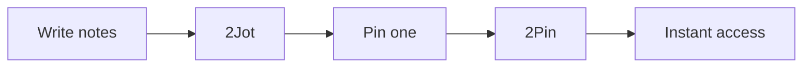

# 2Jot

**Jot it. Pin it. Done.**

A note app that installs **two icons** on your phone.

Website: [2jot.app](https://2jot.app)

## Problem

You jot down notes all day - ideas, tasks, lists. But when you need THE important one, you scroll through everything. Too many taps. Too much friction.

## Solution

**2Jot** (= "to jot") - your note stream. Write quick notes like a chat with yourself.

**2Pin** (= "to pin") - instant access to ONE pinned note. No scrolling, no searching.

All notes stay **only on your phone**. No account. No cloud. No sync.

## How it works

1. Open **2Jot**, write notes
2. Pin the important one (swipe right / double-tap / long-press)
3. Open **2Pin** - your pinned note is right there

## Features

- 📝 Chat-style note stream
- 📌 One pinned note, instant access
- 👆 Swipe right to pin, swipe left to edit
- 📤 Share notes
- 💾 Backup & restore (JSON)
- 🔒 100% offline
- ⚡ Two launcher icons, one APK

## Download

[Download APK](https://github.com/kalba-lab/2jot/releases/latest/download/2jot.apk)

*Google Play coming soon*

## Tech

Kotlin · Jetpack Compose · Material 3

## License

MIT
